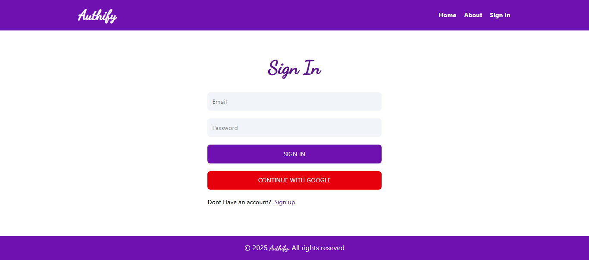

# Authify

**Authify** is a simple and secure full-stack authentication web application built with the **MERN stack** (MongoDB, Express.js, React, Node.js). It allows users to **register, log in, and manage their profiles** effortlessly, with modern security standards and a clean user interface.

---

## 🚀 Features

- User registration and login with secure authentication
- Login with **Google account** via Firebase
- Profile management (update username, email, password)
- Full-stack MERN architecture for scalable and responsive design
- Password hashing with bcrypt for security
- JWT-based authentication for session management
- Responsive frontend built with React and Tailwind CSS

---

## 📸 Screenshots

**Home Page**  

**SignIn Page**  

**SignUp Page**  

**Profile Page**  

---

## 🛠 Tech Stack

- **Frontend:** React, Tailwind CSS
- **Backend:** Node.js, Express.js
- **Database:** MongoDB
- **Authentication:** JWT, bcrypt, Firebase Authentication (Google Sign-In)

---

## ⚡ Getting Started

### 1. Clone the repository

git clone https://github.com/your-username/Authify.git
cd mern-crud-auth

### 2. Install dependencies

**Backend:**

cd backend
npm install

**Frontend:**

cd ../frontend
npm install

### 3. Set up environment variables

Create a `.env` file in the backend folder:

PORT=5000
MONGO_URI=your_mongodb_connection_string
JWT_SECRET=your_secret_key
FIREBASE_API_KEY=your_firebase_api_key
FIREBASE_AUTH_DOMAIN=your_firebase_auth_domain
FIREBASE_PROJECT_ID=your_firebase_project_id
FIREBASE_STORAGE_BUCKET=your_firebase_storage_bucket
FIREBASE_MESSAGING_SENDER_ID=your_firebase_messaging_sender_id
FIREBASE_APP_ID=your_firebase_app_id

_(You can get these values from your Firebase project settings.)_

### 4. Run the app locally

**Backend:**

npm run dev

**Frontend:**

npm run dev

Your app should now be running at `http://localhost:5173` (or Vite default port).

---

## 🔑 Google Sign-In Setup

1. Go to [Firebase Console](https://console.firebase.google.com/) and create a project.
2. Enable **Google Authentication** in the Authentication section.
3. Copy Firebase config keys into your `.env` file.
4. The frontend automatically handles sign-in with Google using Firebase SDK.

---

## 📄 Folder Structure

mern-crud-auth/
│
├─ backend/
│ ├─ models/
│ ├─ routes/
│ ├─ controllers/
│ └─ server.js
│
├─ frontend/ # React frontend
│ ├─ src/
│ │ ├─ components/
│ │ ├─ pages/
│ │ └─ App.jsx
│ └─ index.css
│
└─ README.md

---

## 🌐 Live Demo

_(Add link if deployed)_
e.g., `https://authify.onrender.com`

---

## 📄 License

This project is licensed under the MIT License.

---

This version highlights **Firebase + Google Sign-In**, and guides the user on **how to set it up**.
